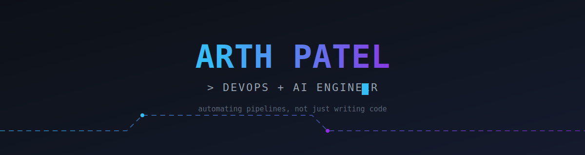
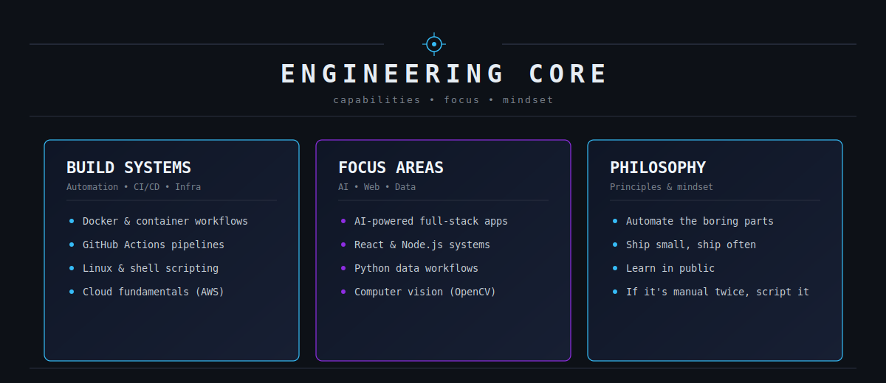

 

## ⚙️ Tech Arsenal

  
tech icons below for quick scanning
  

**DevOps & Cloud**
 

  

**Languages & Frameworks**
 

  

**Data & Databases**
 

  

**Design**
 

## 📊 Vitals

 ⚠️ Renders once the metrics workflow (included below) runs on your repo — see setup notes.

  

### 🏆 Milestones

## 🐍 Contribution Graph

 ⚠️ Renders once the snake workflow (included below) runs on your repo — see setup notes.

## 🤝 Let's Connect

  
<i>⚡ Automating today so tomorrow ships itself.</i>

